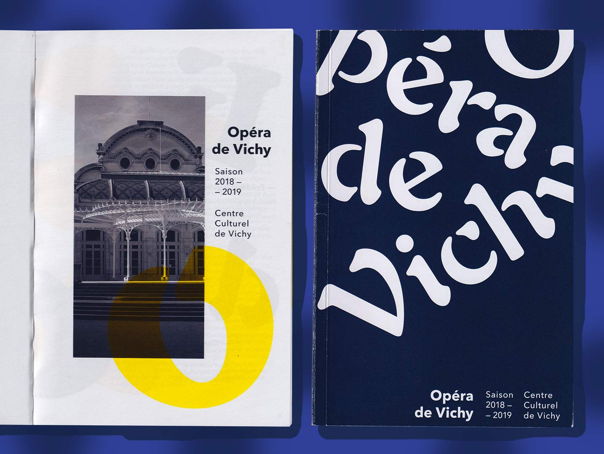

In 2018 I set a major goal for my career: I needed to get a job at a product company. After a couple of years working as an Art Director at an advertising agency I realized that Product Design was the path I wanted to pursue — and working with simultaneous clients and distinct contexts didn't seem to offer me the Product part of it.

After some ups and downs, I joined one of the most exciting startups in Brazil. QuintoAndar was not only changing the rentals market plans further disruption but has a fantastic design team led by talented and inspiring people.

I learned so much going through the hiring process at QuintoAndar I decided to share a few thoughts of what helped me during this journey and what I hope it might help you if you want to do the same change in your career.

# Self-awareness

## Embrace who you are

The first and most important thing you want to do is to get to know yourself better — after all, you should be the one who better knows you, right?

Try to ask yourself a few questions: what are your strengths and weaknesses? What is missing on your profile that you can concretely develop? You have to do this conscious of the moment and context you're coming from — don't let it be an obstacle that stops you from even trying.

Being aware there'll be more experienced designers out there might turn this into an opportunity: what can you do that will be outstanding or unexpected for someone who has no experience at all?
Showing the will to get out of your comfort zone to emerge into a completely new universe shows at least how restless you're willing to be.

It's okay to be yourself, so embrace who you are and show what's best in you.

# Build a process-driven portfolio

Pretty presentations are nice to look at, but if you build a discursive logic of why you designed it, what were your rational motivations and how was your process to get to the final design, your work might end up having much more value perceived.

Think about the Golden Circle by Simon Sinek. If you only show the final design at your portfolio, you're stuck at the superficial surface of what. The value of your work should be better perceived through the exhibition of the whole, meaning that the result might have a deeper meaning within the sequential stages of why, how and what.

That beautiful design is the What — how are you telling their Why and How?

Don't worry about designing fake apps though. Mind why and how you're designing them. Remember the first thought? You're already self-aware of your lack of experience, so it's ok to redesign the Netflix app for the 200th time — just be sure to focus your work on why and how you're doing it, going beyond the beautiful presentation of the interface. Here's a couple of case studies that may inspire you:

[text](https://uxdesign.cc/ios-notification-redesign-concept-b51be406cb60)

[text](https://medium.muz.li/the-youtube-redesign-that-got-me-hired-982b237f77)

What helped me to build a process-driven design case to present for my hiring process was the must-read Sprint by Jake Knapp. I adapted the Design Sprint structure to my design process through frameworks such as How Might We and Long Term Goals.

# Don't focus on software

I first designed a website using Photoshop. I've then worked with Adobe XD before switching to Sketch last year. Some companies are already full on Figma.

Software changes through time. They represent the evolution of the market as different demands start to be met.

Don't focus your studies on the tool you use. It's indeed a positive thing if you're familiar with the software the market most uses, but they are now much easier to learn and you'll probably lose this knowledge with the next big design software.

Focus on the knowledge will be helpful to this moment and to your future despite the tool you use. What is your design process from sketching to the software? How can you iterate within your designs? How about learning how to test your fake design with real users?

This is what I think it means to be a Product Designer: no matter what the what is, you're designing for real people and real problems. What about focusing on them?

# Learn from who's already there

The good thing about Product Design becoming so popular is that there are a lot of people talking about it.

One thing I did while going through my hiring process was to listen to a great Brazilian podcast called Movimento UX, an interview show by Izabela de Fátima featuring designers from companies such as Google, Netflix and many more.

I also started reading a lot of design content on Medium, which comes in handy because I now have the pleasure to work with my favorite Medium author, Letícia Pires, whose articles helped me get closer to this universe.

[text](https://brasil.uxdesign.cc/design-critique-o-segredo-para-segurança-emocional-de-designers-uxconf-2018-cca461caea04)

Including these type of content on your everyday life will be important for you to start to feel secure at this completely new context. You'll learn the right words to use, you'll start to picture what a workday would be like. People might start to perceive more value on you because of this: despite you have no real experience on the role, you already know what to expect.

# Show you're into the company

When I applied for the role of Product Designer at QuintoAndar I tried to make one thing clear: that was my “Google chance”.

Have you ever wondered what would it be like to apply for a job opening at a company where you always wanted to work? That was the case for me: I always had a professional platonic crush on QuintoAndar but it never occurred to me to actually work here.

When the opening went online I almost didn't apply, thinking I should save it for later when I'd be more prepared — I was afraid I'd waste the opportunity for lacking any experience.

But then I settled down: this is where I am now and I genuinely want to work there. What can I do beyond what's expected from me to show them that I'm willing to make up for my current weaknesses?

I decided to design a study based on QuintoAndar's iOS app only to get their attention on how interested I was. Turns out it worked: after a few interviews getting to know a few of my now colleagues, I built a case based on this fake project including a structured design process, reasonings and hypotheses, ideation, sketching, usability testing and a few more things.

This was a conscious effort: I asked myself what I could do that would be unexpected for someone who has no experience at all, and getting to the answer demanded me to know who I was, what people expected me to be and who I wanted to be. Now I'm a Product Designer myself!

# A designer's journey is never over

Designing complex solutions to solve real-life problems demands you to always be reminded that you're designing for real people, not for other designers. This is why lacking the experience of working at a product company should not mean that you lack the ability to design for real people — there are plenty of them out there for you to reach and learn from.

Four months of designing at QuintoAndar made me think of how grateful I am to work with such talented people, dealing with challenging problems every time I get up in the morning and realizing my work has a real impact on real people. Why don't you give it a try?
